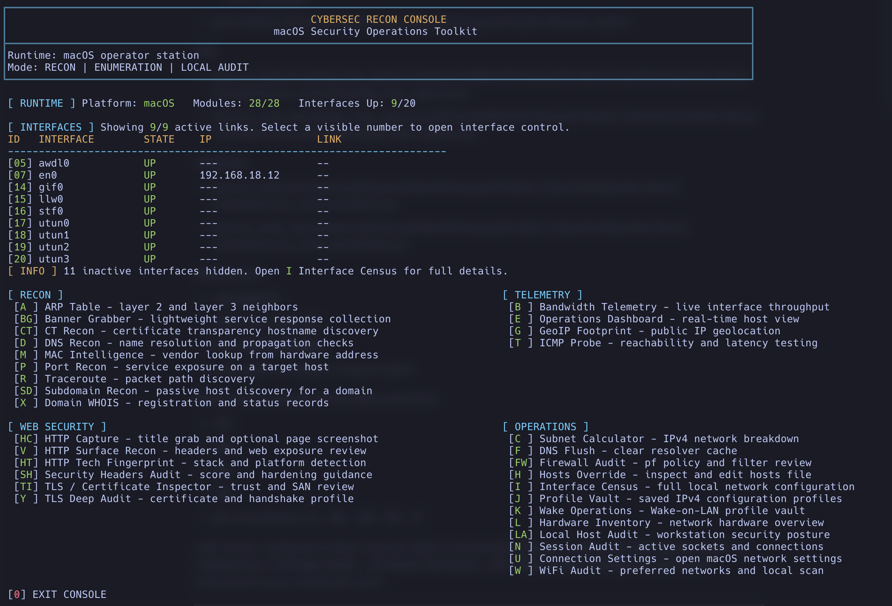

# CyberSec Recon Console

CyberSec Recon Console is a terminal-first toolkit for cybersecurity operators who need fast reconnaissance, local host validation, and web-facing posture review without leaving the shell. It combines practical recon, visibility, and reporting workflows into a single operator console for Linux and macOS.



## Why This Project Exists

- built for real terminal workflows instead of dashboard-heavy overhead
- separate Linux and macOS runtime variants rather than a diluted cross-platform compromise
- focused on useful operator actions, not filler modules
- report generation included for evidence capture and repeatable review

## Platform Model

- `source_code_linux` contains the Linux console and Linux-native modules
- `source_code_macos` contains the macOS console and macOS-native modules
- both variants share the same operational direction, but each keeps platform-specific behavior where it matters

## Capability Map

### Recon and Enumeration

- ARP neighbor mapping and local link visibility
- DNS recon and propagation checks
- MAC vendor intelligence
- port recon and banner grabbing
- traceroute and ICMP validation
- WHOIS and RDAP review
- certificate transparency recon
- subdomain discovery
- ASN / BGP ownership profiling

### Web Security

- HTTP surface recon
- HTTP technology fingerprinting
- HTTP title capture and optional screenshot collection
- security headers audit
- cookie security audit
- CORS posture review
- directory exposure recon
- robots and sitemap recon
- client exposure recon for public JavaScript and endpoint hints
- OAuth / OIDC discovery review
- JWKS keyset inspection
- JWT token inspection

### Email and Trust

- SPF, DMARC, MX, and DKIM posture review
- TLS certificate inspection
- TLS handshake and trust analysis

### Telemetry and Operations

- bandwidth telemetry
- HTTP reachability monitoring
- interface health snapshot
- DNS telemetry and resolver comparison
- GeoIP footprinting
- operations dashboard
- interface census
- hosts override review
- firewall audit
- local host audit
- hardware inventory

## Recommended Operator Flows

### Web Posture Review

1. `V` - `HTTP Surface Recon`
2. `HT` - `HTTP Tech Fingerprint`
3. `SH` - `Security Headers Audit`
4. `CS` - `Cookie Security Audit`
5. `CR` - `CORS Misconfiguration Review`
6. `DE` - `Directory Exposure Recon`
7. `TI` - `TLS / Certificate Inspector`
8. `Y` - `TLS Deep Audit`

### Exposure Discovery

1. `RS` - `Robots / Sitemap Recon`
2. `DE` - `Directory Exposure Recon`
3. `CE` - `Client Exposure Recon`
4. `HC` - `HTTP Capture`

### Identity and Application Discovery

1. `OI` - `OAuth / OIDC Discovery Recon`
2. `JK` - `JWKS Keyset Inspector`
3. `JT` - `JWT / Auth Token Inspector`

### Infrastructure Ownership

1. `AS` - `ASN / BGP Recon`
2. `X` - `Domain WHOIS`
3. `EA` - `Email Security Audit`
4. `CT` - `CT Recon`

### Telemetry and Stability

1. `IH` - `Interface Health Snapshot`
2. `DT` - `DNS Telemetry`
3. `HM` - `HTTP Reachability Monitor`
4. `B` - `Bandwidth Telemetry`

## Quick Start

Prepare Python once for either platform:

```bash
bash setup_python_env.sh
source .venv/bin/activate
```

If you use `fish`:

```fish
source .venv/bin/activate.fish
```

### Linux

Install Linux system dependencies:

```bash
bash bootstrap_linux.sh
```

Start the Linux console:

```bash
bash run_linux.sh
```

### macOS

Install macOS system dependencies:

```bash
bash bootstrap_macos.sh
```

Start the macOS console:

```bash
bash run_macos.sh
```

## Setup Files

- `requirements.txt` - shared Python dependencies
- `requirements-linux-apt.txt` - Linux system packages
- `requirements-macos-brew.txt` - macOS Homebrew packages
- `setup_python_env.sh` - virtualenv bootstrap and Python package install
- `bootstrap_linux.sh` - Linux package bootstrap
- `bootstrap_macos.sh` - macOS package bootstrap
- `run_linux.sh` - Linux launcher
- `run_macos.sh` - macOS launcher

## Repository Layout

- `source_code_linux` - Linux runtime and Linux-native modules
- `source_code_macos` - macOS runtime and macOS-native modules
- `docs/validation-checklist.md` - live validation plan for operator-side testing
- `CONTRIBUTING.md` - contribution notes and project expectations

## Operating Notes

- Linux and macOS are intentionally maintained as separate runtime variants.
- Startup validation stops execution early when required dependencies are missing and explains how to prepare the environment.
- Reports generated by modules are working artifacts for triage, documentation, and follow-up analysis.
- Several modules depend on live network reachability, DNS resolution, and target behavior, so final validation should always be performed from the operator workstation.
- Local runtime data and generated reports are not meant to be committed to the repository.

## Validation

Before calling a release candidate ready, run through:

- `docs/validation-checklist.md`

This checklist covers live module verification, UI review, and platform sanity checks.

## Feedback and Support

If you notice a broken workflow, inconsistent platform behavior, or a module that needs refinement, open a GitHub Issue with:

- the target platform
- the module shortcut and module name
- the observed behavior
- the expected behavior
- any relevant terminal output or report excerpt

If you want to propose a new operator-focused module, open an Issue and describe the use case first. Practical, real-world workflows are preferred over feature volume.

For sensitive findings, security-impacting defects, or cases that should not be discussed publicly, use a private contact channel defined by the repository owner instead of opening a public issue.

## Roadmap Direction

- refine the web security workflow without adding noise
- keep platform parity where it improves real operator value
- strengthen evidence quality and report usefulness
- expand infrastructure and application-layer recon conservatively

## License

CyberSec Recon Console is distributed under the **GNU GPLv3** license. See `LICENSE.md` for details.
